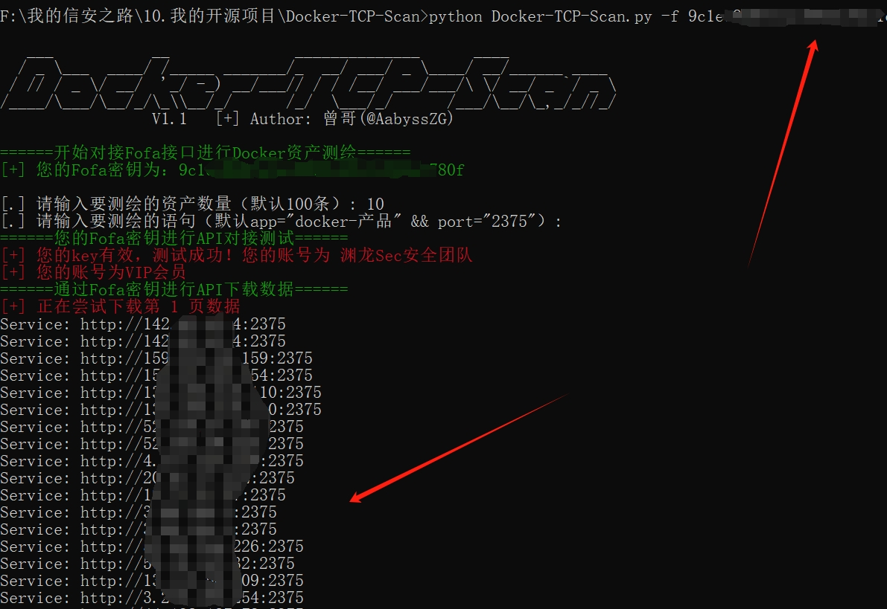
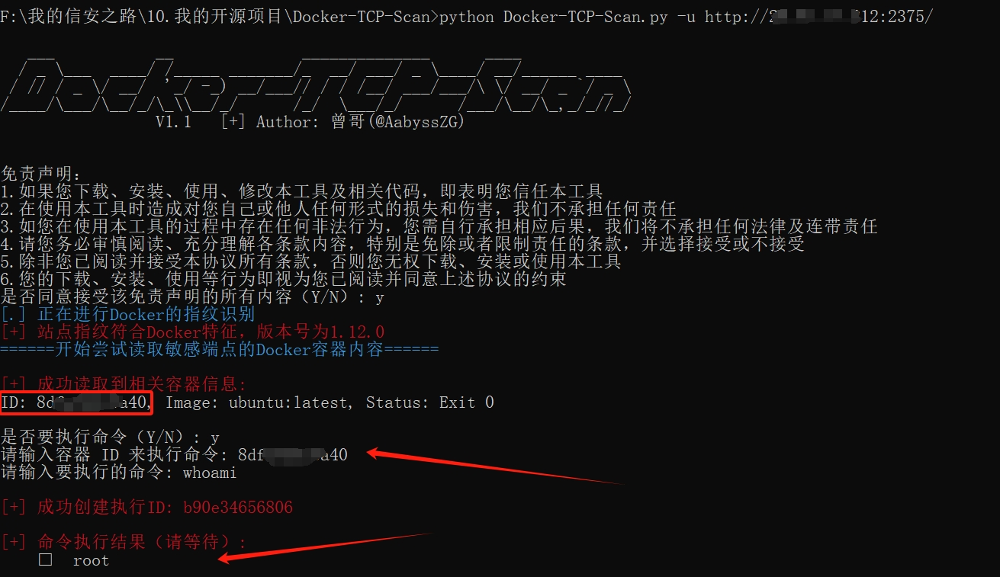
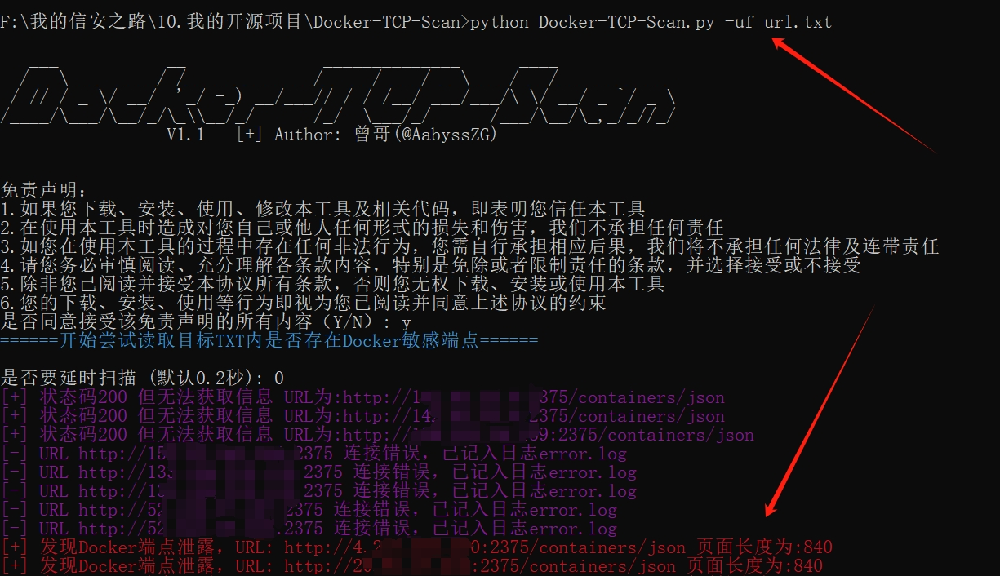

## ✈️ 一、工具概述
随着企业上云逐渐形成了趋势和规模，云安全也成为了新的焦点和『风口』，云上安全越来越重要；在近几年的攻防中『AKSK』、『小程序』、『云上供应链』都已经成为了**兵家必争之地**和**重要突破口**

『由Docker等技术支持的云计算和基础架构即代码（Infrastructure as Code，IaC）决定了构建和部署的软件系统数量。』这是《Developing Docker and Docker-Compose Specifications:A Developer’s Survey》里面的第一句话，随着云计算的广泛应用以及开发和运营团队高效协作的需要，Dcoker的使用越来越突出；**Docker对于云计算而言，十分重要**：Docker 容器允许开发人员将他们的应用程序与所需的依赖项（例如配置、框架、库和运行时）打包到其中,由此可以实现不同云计算之间应用程序的可移植性，提供了一个把应用程序拆分为分布式组件的方法，并且用户还可以管理和括展这些容器成为集群

了解过 `Docker Remote API` 的师傅应该都知道2375端口，2375是Docker远程操控的默认端口，通过这个端口可以直接对远程的docker daemon进行操作；当主机以 **`DOCKER_OPTS="-H tcp://0.0.0.0:2375"`** 这样的配置方式启动Docker时，可以在外部机器对 `Docker Remote API` 进行直接操作：

```bash
docker -H tcp://$HOST:2375 ps
```

> 这种简单配置让Docker Daemon把服务暴露在tcp的2375端口上，这样就可以在互联网上远程操作Docker
>
> 但Docker本身没有身份认证的功能，只要网络上能访问到服务端口，就可以操作Docker！

**这就造成了非常严重的漏洞！能够直接通过 `Docker Remote API` 对相关运行的容器下发恶意命令！**

**特别感谢[国际云安全联盟（CSA）渗透测试工作组](https://www.c-csa.cn)的各位老师给我的建议：**


**本工具旨在以攻促防，是一款针对Docker TCP socket的开源利用工具**

## 🚨 二、安装Python依赖库

注：其他工具基本都使用 `import docker`，而本工具并没有 `import docker`，意味着并不需要在本地渗透环境中安装 `Docker` 从而更加轻量化

```
pip install -r requirements.txt
```

如果pip安装速度慢，可以采用国内源进行安装：

```
pip install -r requirements.txt -i https://pypi.tuna.tsinghua.edu.cn/simple/
```

## 🐉 三、工具使用

如何找到互联网上的 `Docker Remote API` ，ZoomEye语法如下：

```
app:"Docker remote API"
```

Fofa语法如下：

```
app="docker-产品" && port="2375"
```

本工具的参数如下：

```
# python3 Docker-TCP-Scan.py
   ___           __              ______________      ____
  / _ \___  ____/ /_____ _______/_  __/ ___/ _ \____/ __/______ ____
 / // / _ \/ __/  '_/ -_) __/___// / / /__/ ___/___/\ \/ __/ _ `/ _ \
/____/\___/\__/_/\_\\__/_/      /_/  \___/_/      /___/\__/\_,_/_//_/
                 V1.3   [+] Author: 曾哥(@AabyssZG)

用法:
        对单一URL进行Docker端点探测:       python3 Docker-TCP-Scan.py -u http://example.com/
        读取目标TXT进行Docker端点探测:     python3 Docker-TCP-Scan.py -uf url.txt
        下载指定Docker端点的容器日志:      python3 Docker-TCP-Scan.py -d http://example.com/
        使用HTTP代理并自动进行连通性测试:    python3 Docker-TCP-Scan.py -p <代理IP:端口>
        从TXT文件中导入自定义HTTP头部:       python3 Docker-TCP-Scan.py -t header.txt
        通过ZoomEye密钥进行API下载数据:      python3 Docker-TCP-Scan.py -z <ZoomEye的API-KEY>
        通过Fofa密钥进行API下载数据:         python3 Docker-TCP-Scan.py -f <Fofa的API-KEY>
        通过Hunter密钥进行API下载数据:       python3 Docker-TCP-Scan.py -y <Hunter的API-KEY>

免责声明：
        1.如果您下载、安装、使用、修改本工具及相关代码，即表明您信任本工具
        2.在使用本工具时造成对您自己或他人任何形式的损失和伤害，我们不承担任何责任
        3.如您在使用本工具的过程中存在任何非法行为，您需自行承担相应后果，我们将不承担任何法律及连带责任
        4.请您务必审慎阅读、充分理解各条款内容，特别是免除或者限制责任的条款，并选择接受或不接受
        5.除非您已阅读并接受本协议所有条款，否则您无权下载、安装或使用本工具
        6.您的下载、安装、使用等行为即视为您已阅读并同意上述协议的约束
```

## 🛸 四、工具演示

### 0# Docker资产测绘

本工具专门对接了 [ZoomEye的API接口](https://www.zoomeye.org/doc)、 [Fofa的API接口](https://fofa.info/api)、 [鹰图的API接口](https://hunter.qianxin.com/home/helpCenter?r=5-1-2)，使用API-KEY即可批量下载 `Docker Remote API` 的资产测绘数据：

```
python3 Docker-TCP-Scan.py -f <Fofa的API-KEY>
python3 Docker-TCP-Scan.py -z <ZoomEye的API-KEY>
python3 Docker-TCP-Scan.py -y <Hunter的API-KEY>
```



**注：目前该模块已经支持自定义语法的资产测绘导出；资产测绘结束后，会把通过API下载的结果导出到TXT，就可以使用其他参数进行操作啦**

### 1# 测试并使用代理和自定义HTTP头部

#### 测试并使用代理

```
python3 Docker-TCP-Scan.py -p <代理IP:端口>
python3 Docker-TCP-Scan.py -p <HTTP认证账号:HTTP认证密码@代理IP:端口>
```

比如我想对单一URL进行Docker端点探测并使用代理
```
python3 Docker-TCP-Scan.py -u example.com -p <代理IP:端口>
```
同样，其他参数（`-u` / `-uf` / `-d`）均可以配合代理使用

#### 测试并使用自定义HTTP头部（自定义请求头）

```
python3 Docker-TCP-Scan.py -t header.txt
```

使用该自定义HTTP头部功能请自行更改 `header.txt` 内的内容，允许（`-u` / `-uf` /  `-d`）参数使用

### 2# 对单一URL进行Docker端点探测

使用以下命令行对单一URL进行Docker端点探测利用：

```
python3 Docker-TCP-Scan.py -u example.com
```



**注：由于本工具危害巨大，需要明确同意接受该免责声明的所有内容**

### 3# 读取目标TXT进行批量信息泄露扫描

使用以下命令行读取目标TXT进行批量信息泄露扫描：

```
python3 Docker-TCP-Scan.py -uf url.txt
```



新增延时扫描选项，如果不想延时扫描输入 `0` 回车即可

**注：由于本工具危害巨大，需要明确同意接受该免责声明的所有内容；扫描结束后，会把成功的结果导出为同目录下的 `output.txt`**

### 4# 扫描并下载Docker日志

使用以下命令行扫描并下载Docker日志：

```
python3 Docker-TCP-Scan.py -d example.com
```

**注：目前这个功能还在测试当中**

## 🖐 五、免责声明

1. 如果您下载、安装、使用、修改本工具及相关代码，即表明您信任本工具
2. 在使用本工具时造成对您自己或他人任何形式的损失和伤害，我们不承担任何责任
3. 如您在使用本工具的过程中存在任何非法行为，您需自行承担相应后果，我们将不承担任何法律及连带责任
4. 请您务必审慎阅读、充分理解各条款内容，特别是免除或者限制责任的条款，并选择接受或不接受
5. 除非您已阅读并接受本协议所有条款，否则您无权下载、安装或使用本工具
6. 您的下载、安装、使用等行为即视为您已阅读并同意上述协议的约束

## 🙏 六、感谢各位师傅

[](https://star-history.com/#AabyssZG/Docker-TCP-Scan&Date)
